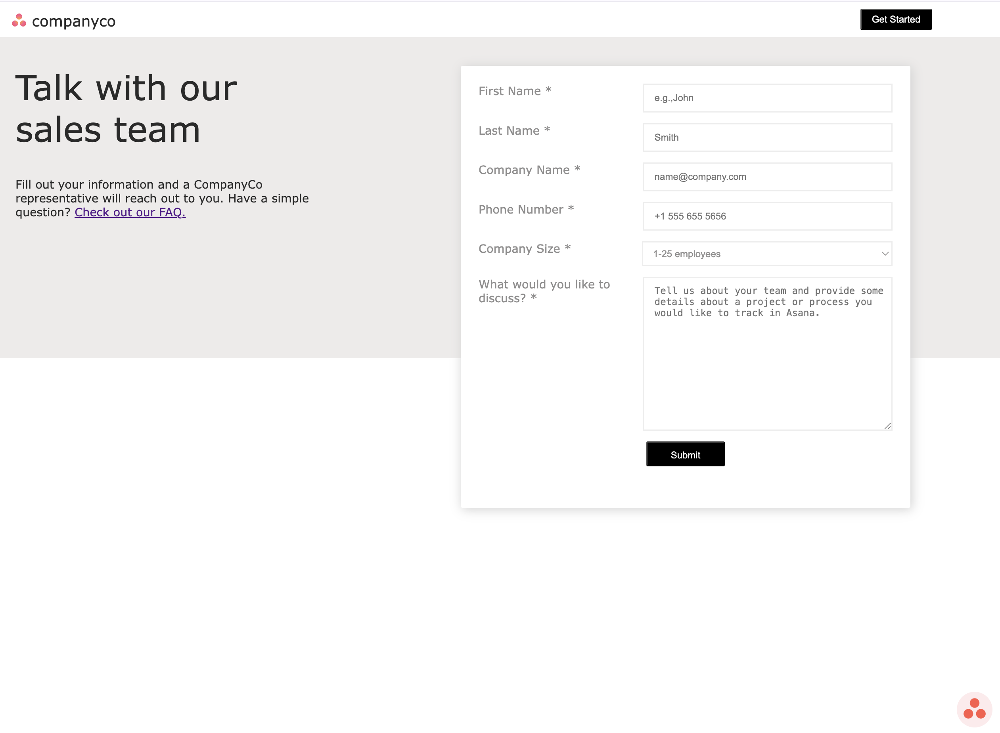
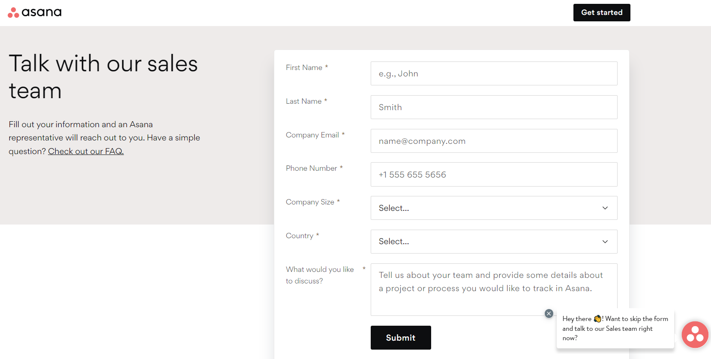

# Landing Page 02

## Technology Used
| Technology Used | Resource URL |
| --------- |:-----------:|
| HTML | [developer.mozilla.org](https://developer.mozilla.org/en-US/docs/Web/HTML) |
| CSS | [developer.mozilla.org](https://developer.mozilla.org/en-US/docs/Web/CSS)

## Description

[Visit the Deployed Site](https://megellman.github.io/landing-page-02/)

I developed a landing page designed to collect visitors' contact information using HTML and CSS. My objective was to closely replicate a reference image, enhancing my skills in webpage alignment and visual recreation. This project significantly improved my understanding of CSS elements and their practical applications.

### Landing Page

### Reference Photo Used

## Megan Ellman

## License

[MIT](https://choosealicense.com/licenses/mit/)

## Questions

[GitHub](github.com/megellman)

If you have any additional questions, you can reach me at meganlellman@gmail.com